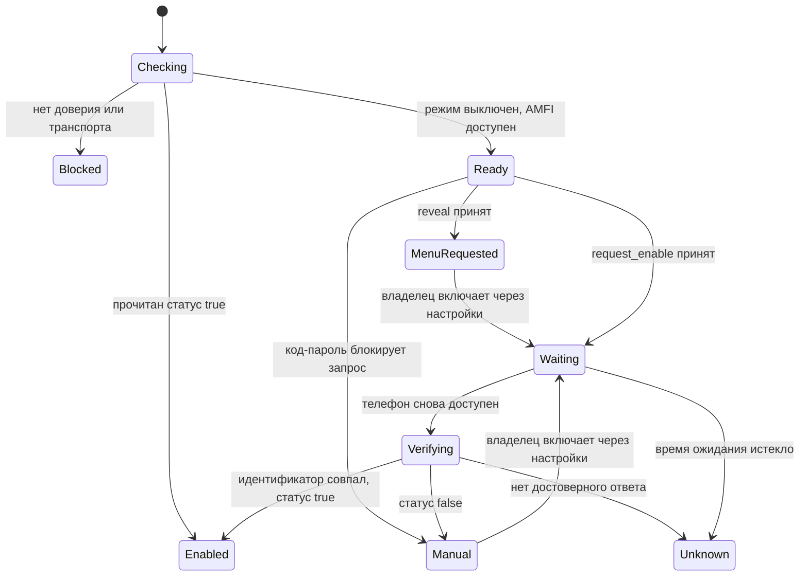

# План: режим разработчика на другом iPhone

> Обновление 1.2: реализованы `cs_developer_mode`, базовая идентичность без SIM, строгие ответы AMFI, отдельный экран и сохранённое ожидание после запроса. Первоначальная доступность AMFI с выключенным режимом на физических телефонах ещё не проверена; USB-C между iPhone отсутствует. Ниже сохранён исходный план исследования 1.1, а текущие возможности описаны в [выпуске 1.2](RELEASE-1.2.md).

**СТАТУС: ПЛАН РЕАЛИЗАЦИИ. ЭТИХ КНОПОК И USB-ТРАНСПОРТА В ВЫПУСКЕ 1.1 НЕТ.**

**ОРИГИНАЛ CARRIERSIM ВЗЯТ ИЗ [IOS-BUNDLES/CARRIERSIM](https://github.com/ios-bundles/CarrierSIM).**

Цель: подготовить iPhone друга из CarrierSIM на своём iPhone, без установки CarrierSIM на телефон друга. Сначала исследовать показ скрытого пункта настроек через доверенное соединение по Wi-Fi, затем запрос включения и проверку после перезагрузки. Друг подтверждает доверие и действия iOS на своём экране. Включение режима разработчика само по себе не включает сотовую услугу 5G.

## Что подтверждено исходниками и документацией

| Механизм | Доказательство | Что ещё предстоит проверить |
|---|---|---|
| Показ пункта настроек | AMFI `action: 0`, служба `com.apple.amfi.lockdown`; есть в vendored idevice и pymobiledevice3. | Доступность службы с выключенным режимом на конкретной iOS и через выбранный транспорт. |
| Запрос включения | AMFI `action: 1`; может запустить перезагрузку. pymobiledevice3 отдельно обрабатывает `Device has a passcode set`. | Поведение на iOS 26 и последних бетах 27; успешный ответ не равен окончательному включению. |
| Подтверждение после перезагрузки | В протоколе есть `action: 2`. Apple описывает подтверждение на экране и ввод код-пароля владельцем. | В первой реализации оставить подтверждение владельцу; автоматическую отправку `action: 2` не включать в пользовательский сценарий. |
| Чтение состояния | pymobiledevice3 читает Lockdown `GetValue`, ключ `DeveloperModeStatus`, домен `com.apple.security.mac.amfi`. | Поддерживаемые типы ответа на целевых версиях iOS; отсутствие ключа означает неизвестное состояние. |
| AMFI через RSD | idevice содержит `com.apple.amfi.lockdown.shim.remote`. | Наличие службы в реально доступном RSD и возможность подключения до включения режима. |
| USB на компьютере | idevice содержит клиент usbmuxd; pymobiledevice3 переподключается после перезагрузки через usbmux. | Подготовка и проверка выбранного компьютера и его драйверов. |
| USB между двумя iPhone | В проекте нет реализации USB host и мультиплексирования для подключённого iPhone. | Сначала доказать доступ к нужному USB-интерфейсу из обычного подписанного приложения iOS. |

Это результаты чтения исходников и документации на 1 октября 2026 года. Физические iPhone в этой среде недоступны; работоспособность перечисленных действий на iPhone 17 Pro Max → iPhone 16 Plus не проверена.

## Первый этап: проверить доступность до включения режима

1. На двух физических телефонах отключить режим разработчика только на целевом iPhone и проверить существующее доверенное сопряжение. Отдельно проверить устройство без готового сопряжения. CarrierSIM на управляющем телефоне должен уже запускаться.
2. Различать обычное Lockdown-сопряжение и Remote Pairing. Нельзя считать файл одного формата подходящим для другой службы. Добавить определение типа записи и понятное состояние «Нужно сопряжение».
3. Для доступного Lockdown по LAN использовать `TcpProvider`, начать защищённую сессию, прочитать идентификатор устройства и запустить AMFI. IP телефона и порт RSD не являются автоматически адресом Lockdown. Порт 62078 использовать только после подтверждения доступности соответствующей службы.
4. Для Remote Pairing отдельно проверить RSD и опубликованную AMFI shim-службу. Не подставлять фиктивный порт службы; не переключаться на loopback или VPN своего iPhone при ошибке подключения к другу.
5. Если Remote Pairing или туннель доступны лишь после включения режима, они не подходят для его первоначального включения. Показать причину недоступности и предложить первоначальное доверенное сопряжение через компьютер. Не создавать цикл «для включения режима сначала включите режим».
6. Зафиксировать модели, точные версии и номера сборок iOS, вид сопряжения, используемый транспорт и ответ службы. Переносить результат на другие модели и версии только после проверки.

Условие перехода к реализации кнопки: на целевом телефоне с выключенным режимом получить доверенное соединение, подтвердить его идентификатор и добиться корректного ответа на запрос показа пункта. Если этого нет, сначала решать транспорт и сопряжение.

## Изменения в проекте

Создать `rust-core/src/developer_mode.rs` с отдельным API для `status`, `reveal` и `request_enable`. Экспортировать узкую функцию `cs_developer_mode` через `rust-core/include/airlift.h`; вход содержит выбранный target, действие и `expected_device_hash`. Выход содержит возможности транспорта, состояние режима, стадию операции и причину отказа. Действия 0–2 не запускать автоматически при обычной проверке устройства.

Выделить в `carrier.rs` чтение базовой идентичности из `device_info`: имя, модель, UDID, iOS и номер сборки. Сейчас эта функция дополнительно требует `CarrierBundleInfoArray`; настройка режима разработчика должна работать и без SIM. Существующие проверки SIM оставить в операциях изменения профиля.

Использовать отдельные ключи выбранного устройства из `CSConnectionManager`, проверять SHA-256 UDID до каждого запроса изменения и после переподключения. Не считать одинаковый IP доказательством, что это прежний iPhone. Смена телефона, pairing-файла или транспорта сбрасывает подтверждение цели.

Перед использованием исправить обработку ответов в `vendor/idevice/src/services/amfi.rs`: методы reveal/enable/accept сейчас проверяют только наличие ключа `success`, поэтому `success: false` ошибочно считается успехом. Сначала обрабатывать `Error`, затем требовать булево `success: true`; отсутствующий, ложный или неверно типизированный ответ возвращает ошибку. Каждое действие открывает новую служебную сессию, как в pymobiledevice3.

Для состояния сначала использовать Lockdown `DeveloperModeStatus`. Булево `true` означает включён, `false` — выключен; отсутствие, отказ или другой тип означает «Не удалось определить». В vendored idevice есть запрос AMFI `action: 3`, но его поддержку на целевой iOS нужно проверить отдельно: не использовать его как единственное доказательство включения.

## Сценарий в интерфейсе

В карточке проверенного iPhone добавить «Режим разработчика» со статусом и доступными действиями. Отдельно показывать «Показать пункт в настройках» и «Запросить включение». Успешный `reveal` отображает «Запрос принят. Проверьте настройки на iPhone друга»; это не сообщение о включённом режиме.

После показа пункта основной путь: друг открывает «Настройки → Конфиденциальность и безопасность → Режим разработчика», включает переключатель, подтверждает перезагрузку, затем включение и код-пароль. CarrierSIM ждёт возвращения телефона и повторно читает состояние. Само открытие нужной страницы настроек другого телефона через сеть не предусмотрено.

Экспериментальный `request_enable` разрешать только при доступном AMFI, проверенной цели и явном действии пользователя с предупреждением о перезагрузке выбранного телефона. При `Device has a passcode set` предложить включить переключатель вручную; не просить снять код-пароль. Другие ответы не превращать в успех и не повторять запрос включения автоматически.

Состояния операции:

Установить пределы времени: 15 секунд на служебный запрос, до 5 минут на ожидание возвращения телефона с возможностью отмены. При перезагрузке разрыв связи ожидаем; без принятого ответа на запрос он не доказывает начало перезагрузки. После тайм-аута показывать неизвестное состояние, разрешать повторную проверку, не отправлять `request_enable` снова.

После перезагрузки заново обнаруживать актуальные адреса и порты и проверять идентификатор. Старые туннели закрыть, данные предыдущей проверки CarrierSIM сбросить. Сохранить только идентификатор цели и стадию ожидания: iOS может приостановить управляющее приложение. При возвращении в приложение повторять проверку. Во время установки IPA, изменения профиля или незавершённого восстановления запрос перезагрузки заблокировать до завершения операции.

## USB-C: две разные реализации

**iPhone → iPhone.** Сначала сделать отдельный прототип: перечисление подключённого USB-устройства, открытие нужного интерфейса, обмен usbmux, доступ к Lockdown и доверие владельца. Проверять с теми разрешениями, которые реально можно получить для IPA пользователя. Клиент usbmuxd в Rust не создаёт USB host-драйвер. Apple описывает DriverKit для macOS и iPadOS на устройствах с M-серией; эта документация не подтверждает такой путь для обычного приложения iPhone. До успешного прототипа поддержку прямого кабеля не заявлять и рабочую кнопку не показывать.

**Компьютер → iPhone.** Независимый вариант без приложения на телефоне друга: небольшой помощник на Mac/PC общается с iPhone через usbmuxd и выполняет чтение состояния/AMFI после доверия на экране. CarrierSIM может управлять помощником по Wi-Fi. Для помощника предусмотреть одноразовое сопряжение через QR, защищённый канал и только перечисленные операции для выбранного UDID; не публиковать сырой usbmuxd в локальную сеть. Это вариант с компьютером, а не прямое соединение двух телефонов.

Для iPhone 12–14 нужен Lightning, для iPhone 15 и новее — USB-C. Даже если прямой USB host-прототип окажется возможен, отдельно проверять кабели USB-C ↔ Lightning и USB-C ↔ USB-C с передачей данных.

## Проверки перед выпуском

Автоматически проверить строгую обработку ответов (`success: false`, отсутствующий ключ, `Error`, неверный тип), код-пароль, отсутствие SIM, неверный pairing-файл, смену идентификатора до действия/после перезагрузки, истечение времени ожидания и запрет повторного запроса включения. Проверить, что ошибка транспорта не превращается в «режим выключен», а принятый запрос не превращается в «режим включён».

На физических телефонах проверить iOS 26 и точную актуальную бету 27; минимум iPhone 12, iPhone 16 Plus и iPhone 17 Pro Max. Сценарии: пункт скрыт/виден, режим выключен/включён, код-пароль установлен/не установлен на отдельном тестовом устройстве, сопряжение отсутствует/подходит/отозвано/принадлежит другому устройству, гостевая Wi-Fi-сеть, смена IP после перезагрузки, блокировка и отмена ожидания. В протоколе испытаний отмечать неподдерживаемые случаи. Успех существующих тестов CarrierSIM не считать тестом новой функции.

Первый выпуск функции должен содержать только чтение статуса и показ пункта на подтверждённых сочетаниях транспорта/iOS. Запрос включения добавить после проверки перезагрузки и повторного чтения статуса. Прямой USB между iPhone остаётся отдельным этапом с собственным критерием работоспособности.

## Источники

- [Apple: Enabling Developer Mode on a device](https://developer.apple.com/documentation/xcode/enabling-developer-mode-on-a-device) — условия появления пункта и подтверждения владельца после перезагрузки.
- [Apple: DriverKit](https://developer.apple.com/documentation/driverkit) — поддерживаемые платформы драйверов.
- [AMFI в vendored idevice](../CarrierSIM-iOS/rust-core/vendor/idevice/src/services/amfi.rs) — действия 0–3 и RSD shim.
- [Провайдеры idevice](../CarrierSIM-iOS/rust-core/vendor/idevice/src/provider.rs) — TCP и клиент usbmuxd.
- [pymobiledevice3: AMFI](https://github.com/doronz88/pymobiledevice3/blob/cd895d17ce8a97d883c10f87b26c7356d5e0ccb1/pymobiledevice3/services/amfi.py) — новая сессия на действие, отказ при код-пароле и повторное USB-подключение.
- [pymobiledevice3: Lockdown](https://github.com/doronz88/pymobiledevice3/blob/cd895d17ce8a97d883c10f87b26c7356d5e0ccb1/pymobiledevice3/lockdown.py) — `DeveloperModeStatus`.
